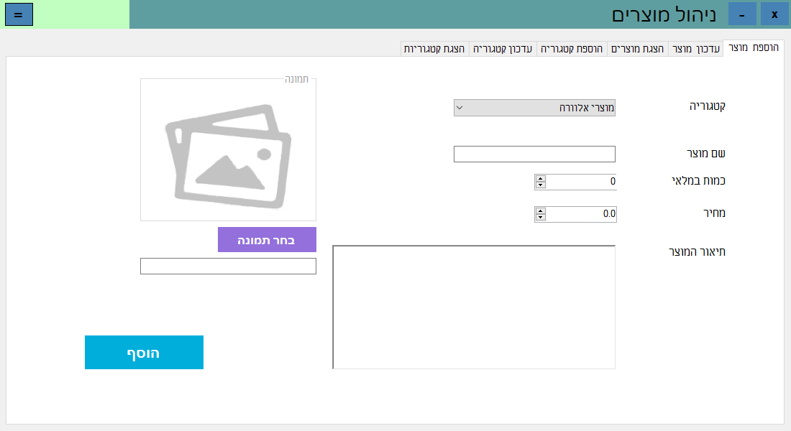

**תכנון ותכנות מערכות ניהול מפעל**

## **הסבר על הדפים השונים בתוכנה:**
### **דף ראשי:**
##### תצלום מסך:

##### הסבר הדף: 
דף זה משמש כמסך הבית של התוכנה, דרך דף זה ניתן להגיע לכל האפשרויות בתוכנה.
### **הסבר על סרגל התפריט:**
הסרגל יכול להתקפל וליפתח על ידי לחיצה על הכפתור המתאים ובכך מאפשר נוחות רבה כאשר רוצים לעבור בין כרטיסיות

### **תהליך ניהול עובדים:**
#### ***הוספת עבדים:***
##### תצלום מסך:

##### הסבר הדף:
דף זה הוא דף הוספת עובד. דרך דף זה ניתן להוסיף את פרטי עובד החשובים שישמרו בתוכנה. ניתן למלא את הפרטים בתוך התיבות ולאחר מכן ללחוץ על כפתור "הוסף" שיאמת את הנתונים ויוסיף את הנתונים לתוכנה או יודיע על שדה לא תקין.
#### ***עדכון פירטי עובד:***
##### תצלום מסך:

##### הסבר הדף:
זהו דף המציג את פרטי העובדים שנשמרו בתוכנה ומאפר לעדכנם, ניתן למלא את הפרטים בתוך התיבות ולאחר מכן ללחוץ על כפתור "ערוך" שיאמת את הנתונים ויוסיף את הנתונים לתוכנה או יודיע על שדה לא תקין.
#### ***הצגת העובדים:***
##### תצלום מסך:

##### הסבר על הדף: 
זהו דף המציג את פרטי העובדים שנשמרו בתוכנה ומאפר למיינם לפי שם פרטי, וותק תאריך לידה ומאפשר לסנן את העובדים הלא פעילם, בנוסף אפשר להדפיס פרטים אלו.
#### ***הדפסת דו"ח עובדים:***
##### תצלום מסך:

##### הסבר על הדף: 
זהו דו"ח המציג את פרטי העובדים בצורה נוחה ומאפשר להדפיס או לישמור את הדו"ח.

#### ***הוספת מקצוע:***
##### תצלום מסך:

##### הסבר על הדף:
דף זה הוא דף הוספת מקצוע. דרך דף זה ניתן להוסיף פרטי מקצוע שישמרו בתוכנה. ניתן למלא את הפרטים בתוך התיבות ולאחר מכן ללחוץ על כפתור "הוסף" שיאמת את הנתונים ויוסיף את הנתונים לתוכנה או יודיע על שדה לא תקין.
#### ***עדכון מקצוע:*** 
##### תצלום מסך:	

##### הסבר על הדף:
זהו דף מציג את פרטי המקצועות שנשמרו בתוכנה ומאפר לעדכנם, ניתן למלא את הפרטים בתוך התיבות ולאחר מכן ללחוץ על כפתור "עדכן" שיאמת את הנתונים ויוסיף את הנתונים לתוכנה או יודיע על שדה לא תקין.

#### ***הצגת מקצועות:***
##### תצלום מסך:

##### הסבר על הדף:
זהו דף המציג את פרטי המקצועות שנשמרו בתוכנה ומאפר למיינם לפי שם התפקיד או המשכורת לשעה ומאפשר לסנן את המקצועות הלא פעילם, בנוסף אפשר להדפיס פרטים אלו.

#### ***הדפסת דו"ח מקצועות עובדים:***
##### תצלום מסך:

##### הסבר על הדף:
זהו דו"ח המציג את פרטי המקצועות בצורה נוחה ומאפשר להדפיס או לישמור את הדו"ח.
### **תהליך ניהול לקוחות:**
#### ***הוספת לקוחות:***
##### תצלום מסך:

##### הסבר הדף:
דף זה הוא דף הוספת הלקוח. דרך דף זה ניתן להוסיף את פרטי הלקוח החשובים שישמרו בתוכנה. ניתן למלא את הפרטים בתוך התיבות ולאחר מכן ללחוץ על כפתור "הוסף" שיאמת את הנתונים ויוסיף את הנתונים לתוכנה או יודיע על שדה לא תקין.
#### ***עדכון פרטי לקוח:***
##### תצלום מסך:

##### הסבר על הדף: 
זהו דף מציג את פרטי הלקוחות שנשמרו בתוכנה ומאפר לעדכנם, ניתן למלא את הפרטים בתוך התיבות ולאחר מכן ללחוץ על כפתור "ערוך" שיאמת את הנתונים ויוסיף את הנתונים לתוכנה או יודיע על שדה לא תקין.
#### ***רשימת לקוחות:***
##### תצלום מסך:

##### הסבר על הדף: 
זהו דף המציג את פרטי הלקוחות שנשמרו בתוכנה ומאפר למיינם לפי שם פרטי, שם משפחה או כתובת מייל, בנוסף אפשר להדפיס פרטים אלו.
#### ***דוח לקוחות:*** 
##### תצלום מסך: 

##### הסבר על הדף: 
דו"ח זה מאפשר למשתמש תצוגה נוחה ומהירה של כלל הלקוחות ומאפשר להדפיס או לישמור את הדו"ח.

### **תהליך ניהול מוצרים:**
#### ***הוספת מוצר חדש:***
##### תצלום מסך:

##### הסבר על הדף:
דף זה הוא דף הוספת מוצר. דרך דף זה ניתן להוסיף את פרטי המוצר החשובים שישמרו בתוכנה. ניתן למלא את הפרטים בתוך התיבות ולאחר מכן ללחוץ על כפתור "הוסף" שיאמת את הנתונים ויוסיף את הנתונים לתוכנה או יודיע על שדה לא תקין.

#### ***עדכון מוצר קיים:***
##### תצלום מסך:

##### הסבר על הדף:
זהו דף מציג את פרטי המוצרים שנשמרו בתוכנה ומאפר לעדכנם, ניתן למלא את הפרטים בתוך התיבות ולאחר מכן ללחוץ על כפתור "ערוך" שיאמת את הנתונים ויוסיף את הנתונים לתוכנה או יודיע על שדה לא תקין.
#### ***הצגת מוצרים:***
##### תצלום מסך:

##### הסבר על הדף:
זהו דף המציג את פרטי המוצרים שנשמרו בתוכנה ומאפר למיינם לפי שם, קטגוריה או כמות ומאפשר לסנן את המוצרים הלא פעילם, בנוסף אפשר להדפיס פרטים אלו.
#### ***הדפסת דו"ח מוצרים:***
##### תצלום מסך:

##### הסבר על הדף:
דו"ח זה מאפשר למשתמש תצוגה נוחה ומהירה של כלל המוצרים ומאפשר להדפיס או לישמור את הדו"ח.

#### ***הוספת קטגוריה:***
##### תצלום מסך:

##### הסבר על הדף:
דף זה הוא דף הוספת קטגוריה. דרך דף זה ניתן להוסיף את פרטי קטגוריה שישמרו בתוכנה. ניתן למלא את הפרטים בתוך התיבות ולאחר מכן ללחוץ על כפתור "הוסף" שיאמת את הנתונים ויוסיף את הנתונים לתוכנה או יודיע על שדה לא תקין.
#### ***עידכון קטגוריה:***
##### תצלום מסך:

##### הסבר על הדף:
זהו דף מציג את פרטי הקטגוריות שנשמרו בתוכנה ומאפר לעדכנם, ניתן למלא את הפרטים בתוך התיבות ולאחר מכן ללחוץ על כפתור "עדכן" שיאמת את הנתונים ויוסיף את הנתונים לתוכנה או יודיע על שדה לא תקין.
#### ***הצגת קטגוריות המוצרים:***
##### תצלום מסך:

##### הסבר על הדף:
זהו דף המציג את פרטי הקטגוריות שנשמרו בתוכנה ומאפשר להדפיס פרטים אלו.
#### ***הדפסת דו"ח קטגוריות מוצרים:***
##### תצלום מסך:	

##### הסבר על הדף:	
דו"ח זה מאפשר למשתמש תצוגה נוחה ומהירה של כלל קטגוריות המוצרים ומאפשר להדפיס או לישמור את הדו"ח.

### **תהליך ניהול הזמנות:**
#### ***הוספת הזמנה:***
##### תצלום מסך:

##### הסבר על הדף:
דף זה הוא עגלת קניות נוחה המאפשרת לבחור לקוח לבחור ולהוסיף מוצרים שונים או להסירם מהעגלה, לבחור תאריך שליחה ולהוסיף את ההזמנה למסד הנתונים על ידי לחיצה על הכפתור "הוספת הזמנה" 

#### ***הצגת הזמנות:***
##### תצלום מסך:

##### הסבר על הדף:
דף זה מטרתו להציג למשתמש את כל פרטי ההזמנות של כלל הלקוחות בדרך נוחה וקלה. למשתמש יש אופציה לחפש בהזמנות השונות על פי תאריך הזמנה, שם הלקוח סכום ההזמנה או על פי כל השדות יחדיו.

כאשר המשתמש בחר הזמנה הוא יכול לבטל אותה על ידי לחיצה על הכפתור "ההזמנה בוטלה". נוסף על כך הוא יכול ללחוץ על כפתור "עדכון הזמנה" ולעדכן את פרטי ההזמנה.

לאחר לחיצה על הכפתור "ההזמנה נשלחה". יפתח למשתמש דיאלוג שיבקש מימנו למלא את עליות ההזמנה.

לאחר מילוי העלויות ההזמנה המשתמש יוכל לאשר את שליחה ההזמנה או לבטל את שליחת, ובכך לצאת מהדיאלוג.
#### ***דו"ח הזמנות:***
##### תצלום מסך:

##### הסבר על הדף:
בדף זה המשתמש יוכל ליצור דו"ח אודות ההזמנות השונות, לפי פרמטרים שונים אותם הוא יכול לבחור בדף זה, לאחר לחיצה על הכפתור "צור דו"ח" המשתמש יוכל לצפות בדו"ח.
#### ***הצגה של הדו"ח:***
##### תצלום מסך:

##### הסבר על הדף:
בדף זה ניתן ליצפות בדו"ח אותו יצר המשתמש. המשתמש יוכל להתבונן בדו"ח, להדפיסו או ליצאו לקובצים בפורמטים שונים כגון קובץ .word

### **תהליך ניהול שעות העבודה:**
#### ***הוספת שעות עבודה לעובדים:***
##### תצלום מסך:

##### הסבר על הדף:
מטרתו של דף זה היא להציג למשתמש את העובדים השונים ולאפשר לו להוסיף להם שעות העבודה על ידי בחירת העובד/ים, מילוי שעות העבודה ולחיצה על כפתור "הוסף".

#### ***דו"ח הזמנות:***
##### תצלום מסך:

##### הסבר על הדף:
בדף זה המשתמש יוכל ליצור דו"ח אודות שעות העבודה והשכר של העובדים השונים, לפי פרמטרים שונים אותם הוא יכול לבחור בדף זה, לאחר לחיצה על הכפתור "צור דו"ח" המשתמש יוכל לצפות בדו"ח.
#### ***הצגה של הדו"ח:***
##### תצלום מסך:

##### הסבר על הדף:
בדף זה ניתן ליצפות בדו"ח אותו יצר המשתמש. המשתמש יוכל להתבונן בדו"ח, להדפיסו או ליצאו לקובצים בפורמטים שונים כגון קובץ .word
### **תהליך ניהול ספקים:**
#### ***הוספת ספק חדש:***
##### תצלום מסך:

##### הסבר על הדף:
דף זה הוא דף הוספת ספק חדש ובו ניתן להוסיף את פרטי הספק לבסיס הנתונים ע"י לחיצה על כפתור הוסף.
#### ***עדכון פרטי הספק:***
##### תצלום מסך:

##### הסבר על הדף:
בדף זה ניתן לצפות בפרטי הספקים ואף לעדכנם בדרך נוחה וקלה לשימוש.
#### ***רשימת ספקים:***
##### תצלום מסך:

##### הסבר על הדף:
דף זה מאפשר גישה נוחה וקלה לפרטי הספקים שנמצאים בבסיס הנתונים של המערכת.

#### ***דו"ח ספקים:***
##### תצלום מסך:

##### הסבר על הדף:
דו"ח ספקים- דו"ח זה מאפשר למשתמש תצוגה נוחה ומהירה של כלל הספקים שלו.
#### ***הודעה לספק:***
##### תצלום מסך: 

##### הסבר על הדף:
דף זה מאפשר למשתמש לשלוח מייל לספקים במטרה ליצור איתם קשר בנוגע להספקת המלאי.
#### ***פלט לדוגמא:***
##### תצלום מסך:
 
### **סטטיסטיקות:**
##### תצלום מסך:

##### הסבר על הדף:
מטרתו של דף זה היא להציג למשתמש את פרטי העסק בצורה ויזואלית ונוחה.

המשתמש יכול לבחור חודש ושנה ולצפות בתשלום הכולל החודשי לעובדים וברווחים והעליות החודשיים מההזמנות השונות.

### **מיזוג רכיבים:**
##### תצלום מסך:
##### הסבר על הדף:

דף זה מטרתו לאפשר למשתמש למזג קבצי word לקובץ אחד.

דף זה מאפשר למשתמש לבחור תיקיה, המשתמש יכול ללחוץ על הכפתור "שמות מהתיקיה" ואז כל שות קיבצי ה word יופיעו, המשתמש יכול לערוך את השמות הללו ולבדוק את הקלט שלו, השמות השונים מופרדים על ידי פסיק או ירידת שורה.

המשתמש יכול לבחור את שמו של קובץ המיזוג הסופי והוא יכול גם לבחור האם בין קובץ לקובץ יהיה מרווח של דף או מרווח של שורה.

לבסוף כאשר המשתמש ילחץ על מזג יווצר קבץ word חדש בשם שניתן לו באותה תיקיה שנבחרה.

#### ***פלט לדוגמא:***

##### תצלום מסך:
##### הסבר על הדף:
דף זה הינו קובץ word לדוגמא אשר נוצר על ידי מיזוג של חמישה קיבצי word שונים

### **הגדרות האפליקציה:**
##### תצלום מסך:

##### הסבר על הדף:
בדף זה המשתמש יוכל לשנות את הגדרות האפליקציה לפי טעמו, הוא יוכל לבחור צבע רקע שונה לכל התוכנה והוא יכול לבחור את מהירות סרגל התפריט.

## **ישויות וקשרים:**

